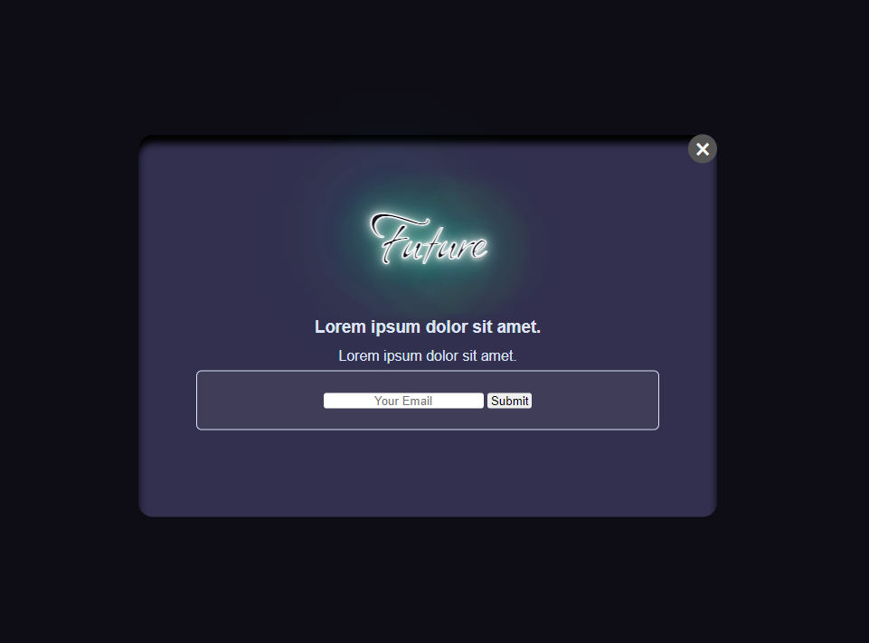
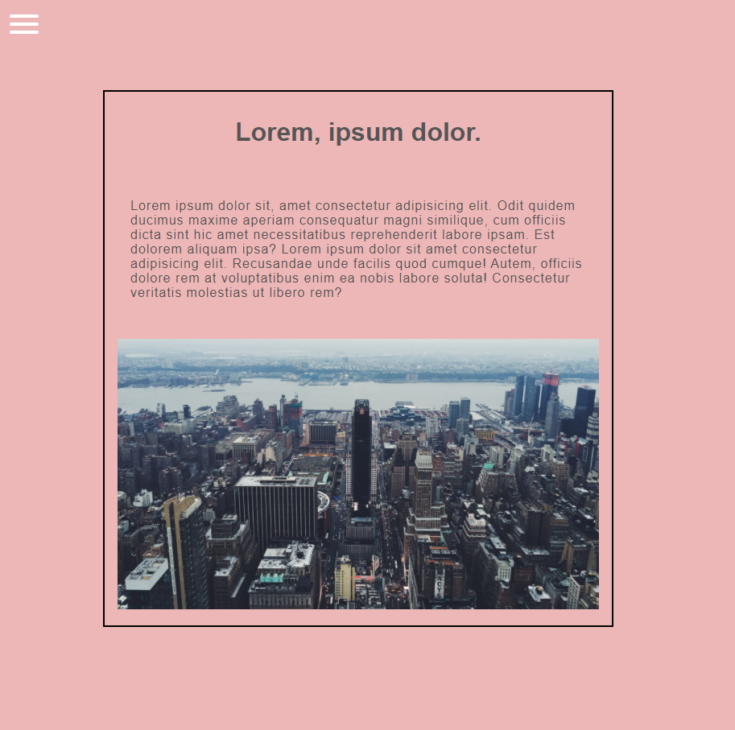
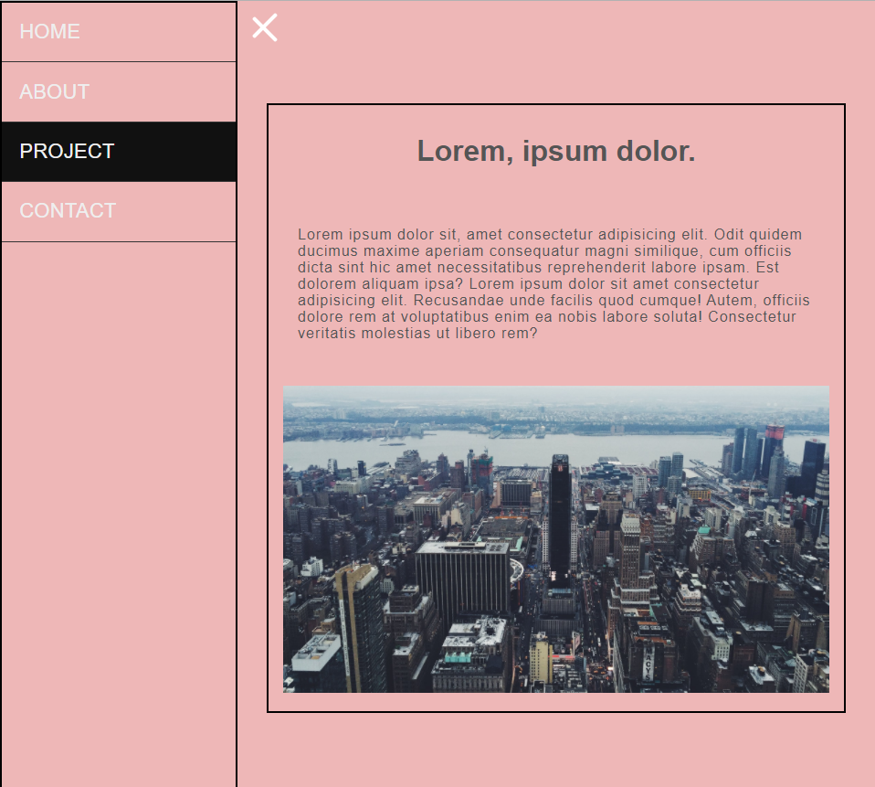
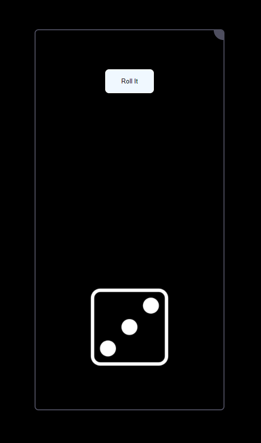
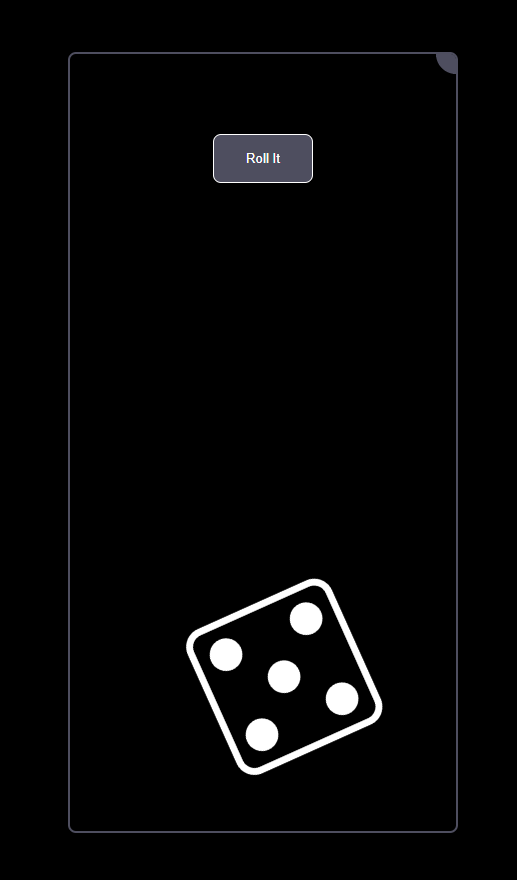

# Learn Modern javascript

Get Your fundamental clear

## Always bet on vanilla JavaScript

## Concepts

Basic [Readme](https://github.com/ullaskunder3/mastering-js/blob/main/Basic/Basic.md)

## Project

1. Slider [project](./Projects/SideBar/)
2. Dice Roll [project]('./Projects/DiceRoll/)
3. Modal [project](./Projects/modal/)
...

preview: sitelink[roots/](https://ullaskunder3.github.io/mastering-js/)
|                                    |                                           |
|------------------------------------|-------------------------------------------|
|    |   |
|   |  |
|     |       |

## Links from where I'm learning JS

- Book like online free [Eloquentjavascript](https://eloquentjavascript.net/index.html)

- Github Repo [Modern-js-cheatsheet](https://github.com/mbeaudru/modern-js-cheatsheet)

- MDN [JavaScript Basic](https://developer.mozilla.org/en-US/docs/Web/JavaScript/Guide)

- MDN [JavaScript Advance](https://developer.mozilla.org/en-US/docs/Web/JavaScript#tutorials)

---

## Projects

- This is JavaScript30 — let's build 30 things together. [javascript30](https://javascript30.com/)

---

## Checklist

don't freak out

- [ ]  Arrays
- [ ]  Functions
- [ ]  Higher Order Function
- [ ]  Arrow functions
- [ ]  this keyword
- [ ]  Modular Programming
- [ ]  Advanced Arrays
- [ ]  Destructuring
- [ ]  Optional chaining
- [ ]  Nullish coalescing
- [ ]  Objects
- [ ]  Arrays of Objects
- [ ]  Advanced Control Flow
- [ ]  Reduce
- [ ]  Classes
- [ ]  Callbacks
- [ ]  AJAX
- [ ]  Asynchronous logic
- [ ]  Advanced classes
- [ ]  Prototypical inheritance
- [ ]  OOP
- [ ]  JSON
- [ ]  Promises
- [ ]  Fetch
- [ ]  Work with real APIs
- [ ]  variable scope
- [ ]  Lexical scope
- [ ]  Async/await
- [ ]  DOM Selection
- [ ]  DOM basics
- [ ]  Advanced DOM
- [ ]  Events
- [ ]  Forms
- [ ]  Package Managers
- [ ]  Module Bundlers
- [ ]  Modules
- [ ]  Dynamic imports
- [ ]  Legacy var
- [ ]  Legacy topics
- [ ]  Window object
- [ ]  Closures
- [ ]  Regular Expression
- [ ]  Loops & iteration
- [ ]  The event loop
